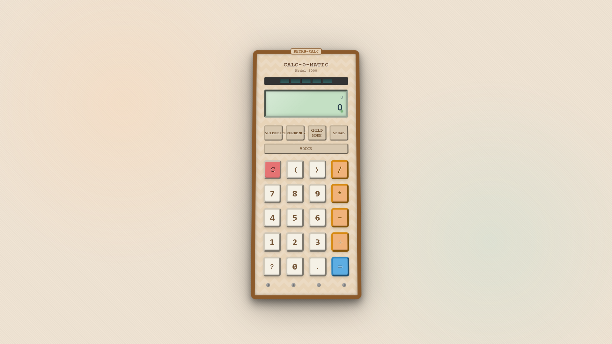

# Retro Calculator

Vintage-style calculator application with modern capabilities built with Svelte, TypeScript, and Tauri.

## 📱 Preview



## 🚀 Features

- **Authentic Retro Design**: Beautifully crafted vintage calculator interface with visual effects that mimic classic electronic devices
- **Basic Arithmetic**: Addition, subtraction, multiplication, division with clean and responsive UI
- **Scientific Mode**: Extended functions including trigonometry (sin, cos, tan), logarithms, π, e, and square root
- **Currency Conversion**: Real-time currency conversion between USD, EUR, and UAH using live exchange rates
- **History Tracking**: Saved history of calculations with ability to reuse previous results
- **Voice Input**: Support for voice commands and calculations (where browser supports Web Speech API)
- **Voice Output**: Option to hear calculation results spoken aloud
- **Child Mode**: Simplified interface for children with friendly messaging
- **Keyboard Support**: Full keyboard input support for fast calculations

## 🛠️ Technology Stack

- **Frontend**: 
  - [Svelte](https://svelte.dev/) - Reactive UI library
  - [TypeScript](https://www.typescriptlang.org/) - Type safety and better developer experience
  - [Vite](https://vitejs.dev/) - Fast development server and bundling

- **Backend/Desktop**: 
  - [Tauri](https://tauri.app/) - Lightweight desktop application framework
  - Rust backend for scientific calculations

- **APIs**:
  - [Exchange Rate API](https://exchangerate.host/) - Free currency exchange rate data

## 📦 Installation

```bash
# Clone the repository
git clone https://github.com/Maks0101aps/Calculator.git

# Navigate to project directory
cd Calculator

# Install dependencies
npm install

# Run in development mode
npm run dev

# Build for production
npm run build
```

## 🧩 Usage Examples

### Basic Calculation
Enter numbers and operators using the calculator buttons or keyboard, then press "=" to get the result.

### Scientific Calculations
1. Click the "Scientific" mode button
2. Use specialized functions like sin, cos, tan, log, π, e, etc.
3. Get precise mathematical results

### Currency Conversion
1. Enter a number
2. Click the "Currency" mode button
3. Select the desired currency (USD, EUR, UAH)
4. The value will automatically convert based on current exchange rates

### Voice Commands
1. Click the "Voice" button to activate voice recognition
2. Speak your calculation (e.g., "five plus seven")
3. The calculator will process your speech and compute the result

## 🧐 Easter Eggs

This project contains several hidden easter eggs created by [Maks0101aps](https://github.com/Maks0101aps):

1. **Calculator Serial Number**: Check the back of the calculator (click it 5 times quickly)
2. **Developer Mode**: Press the key combination "Ctrl+Shift+D" to unlock special features
3. **Color Themes**: Type "rainbow" using the calculator buttons
4. **Secret Message**: Enter the sequence "1337" and press all mode buttons simultaneously

*Hint: Use the Calculator History to uncover additional clues!*

## 🤝 Contributing

Contributions are welcome! Please feel free to submit a Pull Request.

## 📄 License

This project is licensed under the MIT License - see the LICENSE file for details.

## 👨‍💻 Author

- [Maks0101aps](https://github.com/Maks0101aps) - Creator and lead developer

---

Made with ❤️ in Ukraine 🇺🇦
